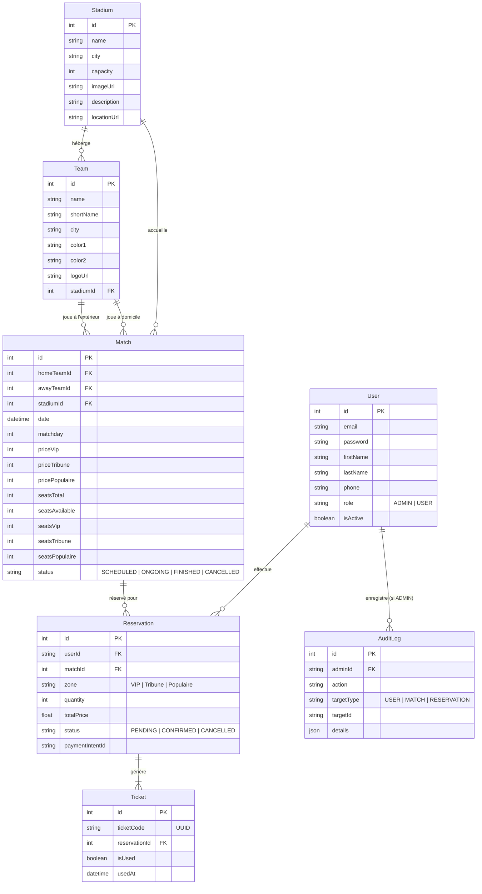
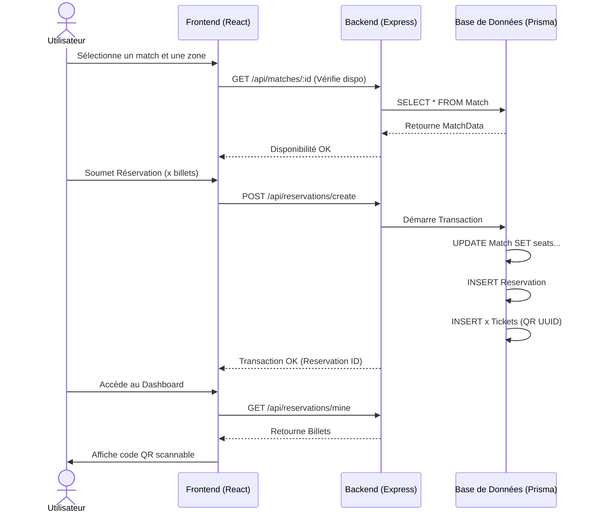

# Diagrammes UML et Conception - BotolaTickets

Ce document détaille l'architecture des données sous forme de diagrammes relationnels (Entity Relationship Diagrams) générés via syntaxe Mermaid.

## Schéma de Base de Données (Modèle Relationnel Prisma)

## Cycle de Vie d'une Réservation (Flux de Données)

